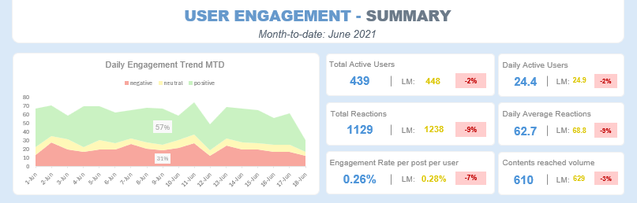

# **Social Buzz - Engagement Analysis - Bi-weekly Update**
_**Author**: Thu Pham | **Date**: 06/2025_

## *Table of Contents*
1. [Project Background](#1-project-background)  
2. [Data Structure & Initial Checks](#2-data-structure--initial-checks)  
3. [Executive Summary](#3-executive-summary)  
4. [Insights Deep Dive](#4-insights-deep-dive)  
5. [Recommendations](#5-recommendations)
6. [Assumptions and Caveats](#6-assumptions-and-caveats)

## _**1. Project Background**_

 

This project focuses on a comprehensive data analysis of **Social Buzz**, a dynamic social media platform that has achieved remarkable growth, boasting **over 500 million active users (Monthly Active Users - MAU)** within just five years. A key differentiator for Social Buzz is its emphasis on **user anonymity**, . The platform supports a rich content ecosystem with **16 distinct content categories** and **four content formats** (GIF, audio, video, photo).

This portfolio project simulates the role of a Junior Data Analyst within a data team, responsible for monitoring and driving platform engagement. Specifically, the project involves conducting **bi-weekly engagement review meetings** to present actionable insights to product teams, content teams and marketing divisions, all of whom are invested in or responsible for enhancing platform engagement.

The analysis delves into crucial social media performance metrics and KPIs, including:

* **User Activity & Growth:** Monitor **Monthly Active Users (MAU)** and **Total Reactions** to assess platform engagement and long-term growth. 
* **Content Performance & Reach:** This objective evaluates how effectively content surfaces to and engages users, measured by the **Content Activation Rate** and the proportion of **unengaged content** over time, along with the **average daily content interactions per user**.
* **Content Quality & Sentiment:** Here, we aim to identify and categorize "power categories" versus underperforming ones by analyzing overall **positive sentiment percentages** and delving into specific **reaction types** to understand nuanced user emotional responses to content.
* **User Behavior Patterns:** This segment focuses on optimizing content delivery by pinpointing **optimal engagement windows** (e.g., by day of week and hour) and identifying activity peaks, informing tailored content scheduling strategies.

An interactive Excel Dashboard used to report can be found here [link](Social_Buzz_dashboard.xlsx)

The bi-weekly report file hypothetically used for presentation in bi-weekly meeting can be found here [link]

The presentation in video format can be found here [link].

## _**2. Data Structure & Initial Checks**_
The database structure for the meeting seen below consists of three tables:
- **`Contents`**: This dataset contains **1,000 distinct entries**, with each row representing a unique piece of content available over the past twelve months. Key attributes include a unique content ID, its associated creator (`User_id`), the content's format (e.g., video, photo), and its thematic category..
- **`Reactions`**: Comprising **approximately 25,000 rows**, this table records each user interaction with content. Every entry specifies the user (`User_id`), the `Content_id` they reacted to, the exact date and time of the reaction, and the specific type of reaction applied.
- **`ReactionsTypes`**:  This lookup table provides definitions for each reaction type available on the platform. For every reaction, it details its overall `Sentiment` (e.g., positive, neutral, negative) and assigns a `Score` that quantifies its emotional intensity. 

 

## _**3. Executive Summary**_

Social Buzz has maintained a stable base of **480-490 reacting users per month** over the past year. However, **June 2021** signals a critical challenge, with a **2% drop in active users** and a **9% decrease in total reactions**, and a low Engagement Rate per Post per User of 0.26% indicating a pressing need for sustained growth initiatives.

Our analysis reveals significant gaps in content effectiveness, as only **76% of content successfully reaches audiences** in the past month, and a concerning **4% remains entirely unengaged** over a 12-month period. This is compounded by a shallow average of just **1.04 reactions per user daily**, and an average **Engagement Rate per Post per User of 0.42%-0.43%** over the last 12 months (which is notably below the healthy benchmarks of 1% to 5% in 2020-2021), underscoring substantial untapped potential for deeper platform engagement.

Despite these challenges, "power categories" (e.g., 'animals', 'technology', 'science') consistently drive high **positive sentiment**, accounting for **over 57%** of total reactions, contrasting with persistent underperformers. User behavior patterns identify **peak activity on Tuesdays** and a notable 3 AM - 6 AM activity surge, highlighting clear opportunities to optimize content delivery strategies for our diverse, global user base.

## _**4. Insights Deep dive:**_
### *4.1. Main Insight 1: Month-to-Date Performance - A Decline in Key Engagement Metrics*  
- While daily reactions for June 2021 MTD show overall stability with consistent positive sentiment, all key engagement metrics declined significantly compared to last month: **Total Active Users by 2% (439)**, **Reactions Volume by 9% (1129)**, and **Contents Reached by 3% (610 posts)**.
- The daily reaction trend in June MTD, though generally stable, exhibits fluctuations with a noticeable **dip towards the mid-month** mark (around Saturday, June 12th - **49 reactions to posts**) after a peak in the preceding Friday.
- This has resulted in **a low Engagement Rate per Post per User of 0.26%**, which is notably below the healthy social media *benchmarks of 1% to 5%* observed in 2020-2021, (Instagram tengagement around 0.98%-1.79%, Facebook around 0.08%-0.27%) [[1]](https://get.rivaliq.com/hubfs/eBooks/2021-Rival-IQ-Social-Media-Benchmark-Report.pdf). This implies that content discoverability need to be improved (only 61% posts reached the audience) and invidual items are not not effectively capturing engagement.

### *4.2. Main Insight 2: Last 12 month engagement trend*
- Over the past year, both **active reacting users (around 480-490 per month)** and **Total Reactions (consistently above 2000 per month, peaking at 2138 in May 2021)** have remained stable, signaling a plateaued growth.
- The **Engagement Rate per Post per User mirrored this stability**, averaging around **0.42%-0.43%** for most of the year, with a recent dip to **0.26% in June 2021**. This indicates that the fundamental interaction dynamic per content piece per user has not significantly improved over the long term.
- TCrucially, the **persistently low "Daily Average Contents Reacted per User" at 1.04** highlights a significant, year-long untapped opportunity to drive deeper engagement from existing users.

### *4.3. Main Insight 3: Content Reach - Significant Gaps in Activation*
- Over the past 30 days, only **76% of the total content successfully reached the audiences** over the past 30 days meaning 24% (238 out of 1000 posts) failed to generate any interaction.
- Category performance varies significantly: **"Healthy eating" leads with an 87% reaction rate**, "animals" and "cooking" (85%). While **"tennis" lags notably at 59%**, indicating clear differences in content resonance.
- The **average reactions per post stands at 5.38**, with some categories like **"cooking" (3.1 reactions per post)** performing above average, while others like **"veganism" (2.4 reactions per post)** fall below, revealing opportunities for content optimization.

- The overall content engagement distribution over 12 months shows that the highest percentage **22% of content received 31-40 reactions (224 posts)**, indicating a healthy proportion of content achieving moderate to high engagement over the long term, with an **average of 25.5 reactions** per post.
- A critical finding is that **4% (38 pieces) of content received 0 reactions**, despite a high overall content reaction rate of **96%**. This consistently unengaged content represents a clear area for portfolio refinement.

- **Categories Contributing to Zero Engagement:** "tennis", "fitness" has correspondingly 10% and 8% of their contents received no reactions at all. 

### *4.4. Main Insight 4: Content category performance and Sentiment Divergence*
- The content portfolio strategy successfully drives positive sentiment, with **57% of total reactions being positive**.
- In June 2021, a strong positive correlation exists between "Total Score" (popularity) and "Reaction Times" (volume) for "power categories" like "animals", "technology", and "science", indicating content that consistently elicits both high-scoring positive emotions and high interaction volume. Conversely, categories like "tennis", "public speaking", and "studying" consistently show low scores and low reaction volumes, signaling a struggle to resonate.
- **Niche categories, such as "soccer", present a unique pattern**: while ranking high in 'Total Score' (5th), their 'Reaction Times' are relatively lower (10th). This suggests these topics are appreciated by a dedicated audience, but do not drive broad, frequent engagement.
- Social Buzz anonymity succeeded in encouraging a wide range of genuine interactions: Present of **'scared' (Rank 1 overall)**, 'dislike', and 'indifferent' among the most used reactions. 

- Sentiment distribution significantly differentiates content quality: **Most popular content strongly elicits deep positive emotions** (e.g., 'cherish', 'heart') , while **less popular content triggers a higher proportion of negative (36%) and neutral (14%) reactions**, including 'dislike' and 'indifferent', reflecting lower perceived value.

 

- The long-term trend for engagement shows a remarkably stable content performance landscape over the past 12 months. Categories like "animals" and "healthy eating" consistently perform well, while "public speaking", "tennis", and "veganism" consistently show low interest. Our contents base is lacking notable growth or shifts in user preferences across categories, highlighting a need for industry benchmarking.

### *4.5. Main Insight 5: User Behavior Patterns: Strategic Timing for Engagement*
- **Peak Engagement Mid-Week:** For June MTD, user engagement peaks mid-week, with **Tuesdays showing the highest average daily reactions at 66.7**, while Mondays are close behind at 66.0. This provides clear opportunities for content scheduling.
- **Significant Weekend Dip:** Engagement consistently **dips notably on Fridays (58.0 reactions) and Saturdays (59.5 reactions)**, with Saturday being the lowest performing day.
- **Unexpected Early Morning Surge:** A pronounced and **unexpected activity peak occurs between 3 AM and 6 AM**, with average reactions reaching **3.11 at 5 AM**. This strong early morning activity strongly suggests a significant segment of the user base operates in different time zones, highlighting a global audience in the current month.

## _**5. Recommendations**_
Based on our comprehensive analysis of Social Buzz's engagement landscape, we propose the following strategic recommendations:

- **Optimize Content Portfolio to prevent inconsistent category performance:**
    - Increase production in "power categories" (e.g., "animals", "technology") via influencer collaborations. Conduct competitive benchmarking and trending landscape analysis to refine strategy for underperformers (e.g., "tennis", "public speaking").
    - Enhance content quality by deeply analyzing content attributes and metrics (e.g., hashtags, titles) to identify engagement drivers.
- **Refine Algorithm & User Experience to address low 0.26% Engagement Rate per Post per User and 1.04 reactions per user daily**
    - Implement A/B tests on recommendation models and enhance UX/UI with "next content" suggestions/prompts.
    - Refine contents and user interaction flows to encourage more reactions. 
    - Explore new engagement mechanisms like additional reaction types or novel content formats.
- **Deepen Understanding of User Engagement: to address the limited engagement resulting from a single interaction per day**
    - User Demographics & Preferences: Analyze audience segments and content preferences.
    - User Journey Mapping: Visualize user flows to identify key interaction points.
    - Interaction Analytics: Examine granular user behaviors with content and UI.
    - Content Consumption Depth: Measure deeper engagement beyond initial reactions.
- **Refine Content Delivery to align with users behavior**:
    - Adjust publishing schedules to align with Tuesday peaks and leverage the 3 AM - 6 AM activity surge to effectively reach global users. 
    - Implement A/B tests on UI elements (e.g., "trending now" sections) to improve discoverability.

## _**6. Assumptions and Caveats**_
This analysis is built upon specific assumptions and acknowledges certain caveats regarding the provided datasets:
- **Sample Data Scope:** This analysis uses a sample of Social Buzz activity (e.g., ~480-490 monthly reacting users, 1,000 content items), assumed to be representative for this engagement study, despite the platform's 500M+ total users.
- **Active User Definition:** "Active users" are strictly defined as individuals who recorded at least one "reaction" within the given period.
- **Data Quality:** Analysis was performed on pre-processed data, noting specific issues:**missing values in Reactions table's `User_ID` (3019 rows) and `Type` columns (980 rows)** were deleted, assuming that these rows does not affect the overall analysis.
- Sample Size Context: The relatively "low" content and user numbers in the sample are attributed to the project's focus on a detailed slice of user behavior and interactions, rather than reflecting the entire platform's scale.